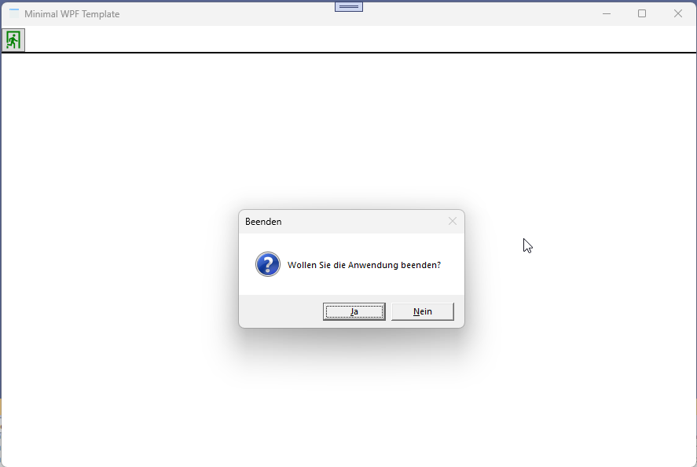

# Minimal WPF Applikation


]

Projekt Template für eine minimale WPF Window Applikation wie diese für kleine Programme verwendet werden kann.
Das kleine WPF Programm beinhaltet noch eine einfache *OnPropertyChanged()* implementierung.



Das kleine WPF Template kann direkt für weitere Zwecke erweitert und kompiliert werden. Es werden keine zusätzlichen Koponenten verwendet.

## Installation Template
Zur Installation und Verwendung der Projektvorlage **MinimalWPF_V2.zip** muß diese zuvor in folgendes Verzeichnis kopiert werden.

Das Verzeichnis **\MinimalWPF** muß erst manuell erstellt werden.

```bat
c:\Users\<username>\Documents\Visual Studio 2022\Templates\ProjectTemplates\Visual C#\MinimalWPF\MinimalWPF_V2.zip
```

In der Regel wird der Template Cache automatisch aktualisiert. Sollte die Vorlage nicht gefunden bzw. ausgewählt werden können, kann es notwendig sein denn TemplateCache zu löschen.
```bat
REM ItemTemplate Cache
c:\Users\<username\AppData\Roaming\Microsoft\VisualStudio\17.0_a0c33062\ProjectTemplatesCache\Visual C#\MinimalWPF\
```

